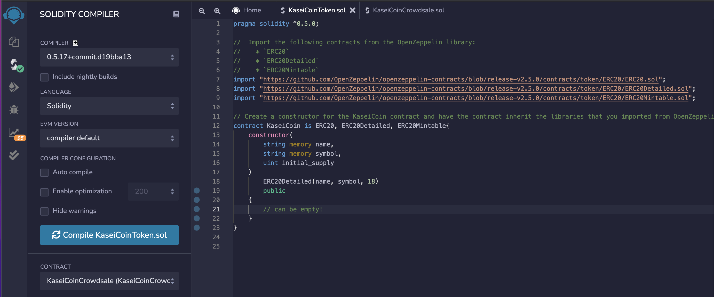
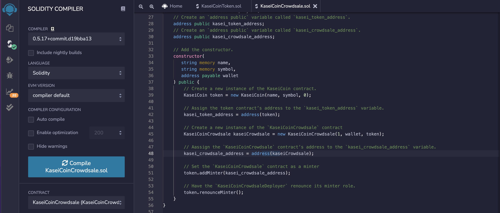

# KaseiCoin

This smart contract principal function is to automate financial processes, such as hosting joint savings accounts.

Solidity smart contract that accepts two user addresses. These addresses will be able to control a joint savings account. The smart contract will use ether management functions to implement a financial institution’s requirements for providing the features of the joint savings account. These features will consist of the ability to deposit and withdraw funds from the account.

---

## Technologies

* [Solidity](https://docs.soliditylang.org/en/v0.8.11/) 

* [Remix](https://remix.ethereum.org/) 

* [OpenZeppelin](https://openzeppelin.com/)

---

## Usage

This is a basic smart contract setup that shows the use of the implemented functions such as  set up accounts, deposit, withdraw, balance check, last transaction address and amount the following images demonstrate  an example of the mentioned functions the rest of the transactions will be found in the (Execution_Results) folder

---

## Evaluation Evidence:

[KaseiCoinToken](images/https://youtu.be/K5aZZ8FO1CY)

---

## Contributors

Israel Fernandez -- codan81@gmail.com

---
## License
MIT License

Copyright (c) 2021  

Permission is hereby granted, free of charge, to any person obtaining a copy
of this software and associated documentation files (the "Software"), to deal
in the Software without restriction, including without limitation the rights
to use, copy, modify, merge, publish, distribute, sublicense, and/or sell
copies of the Software, and to permit persons to whom the Software is
furnished to do so, subject to the following conditions:

The above copyright notice and this permission notice shall be included in all
copies or substantial portions of the Software.

THE SOFTWARE IS PROVIDED "AS IS", WITHOUT WARRANTY OF ANY KIND, EXPRESS OR
IMPLIED, INCLUDING BUT NOT LIMITED TO THE WARRANTIES OF MERCHANTABILITY,
FITNESS FOR A PARTICULAR PURPOSE AND NONINFRINGEMENT. IN NO EVENT SHALL THE
AUTHORS OR COPYRIGHT HOLDERS BE LIABLE FOR ANY CLAIM, DAMAGES OR OTHER
LIABILITY, WHETHER IN AN ACTION OF CONTRACT, TORT OR OTHERWISE, ARISING FROM,
OUT OF OR IN CONNECTION WITH THE SOFTWARE OR THE USE OR OTHER DEALINGS IN THE
SOFTWARE.
